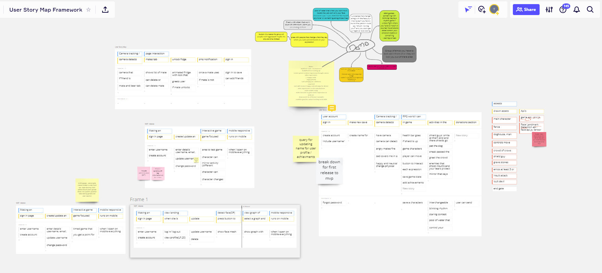
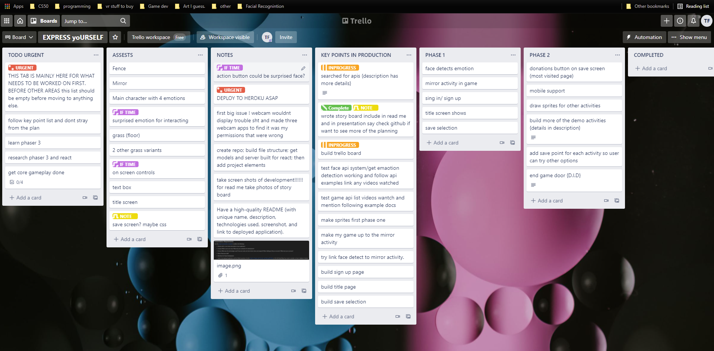
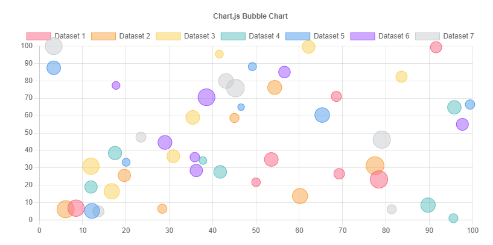

# EXPRESS-yoURSELF

## Description:

---

The start of an application that will be used for product testing, beta testing or personal interest (find out if you're really enjoying your favorite game or movie)

Heroku link of progress so far: [EXPRESS-yoURSELF](https://react-express-yourself.herokuapp.com/).

---

## Table of Contents:

- [Usage](#usage)
- [Planning](#planning)
- [License](#license)
- [Future Plans](#future-plans)
- [Technologies](#technologies)
- [Contributing](#contributing)
- [Questions](#questions)
- [Presentation](#presentation)

---

## Usage:

At this time the app is still in development, being worked on by a single UWA student. Who only has 6months experience with web developement. But im confident I can get this product to function as intended with more time.\
To view progress view the Heroku link above in the description [Here](#description).

---

## Planning:

The idea for this product changed a lot throughout development mostly due to time constraints.
If you are interested in what went into planning this product view the images and links below:

 

I started with Miro and planned out a user story:

[Link to board](https://miro.com/app/board/o9J_l4d8TP8=/)

 

Once I had a solid idea of what i wanted to achieve I wrote a [press release](https://docs.google.com/document/d/1YMZylozOyr_6TOA9Ju-uYEWSkKFkWu1mavHIqd6BjEg/edit?usp=sharing) and then started some plans and tasks on a [Trello board](https://trello.com/b/nxkpbz4W/express-yourself) to keep myself on track.

Once I had all my plans down I [story boarded](https://drive.google.com/drive/folders/1Muils9CKx3C5rS8vdiGQ4TTGdVlqzgBt?usp=sharing) my app which started out as a game but soon changed to this product testing app which you can see after all the game story boards, but I am very excited to continue working on both as separate products.

---

## License:

This repository is licensed under the [GPL-3.0](https://opensource.org/licenses/GPL-3.0) license.

---

## Future Plans:

- What does the future hold for EXPRESS-yoURSELF?
- Well first of all I would like to go through and restyle the whole app and give it a more professional look my styling started with the vision that the app was going to be more game related but now that the vision has changed so shall the appearance.
- Next the key feature I need to implement is for the landmark detection to detect emotions. Through my research i am confident I can achieve this.
- once emotions are detected i can focus on recording that data and translating it to a chart using [chart.js](https://www.chartjs.org/).\
  Mock up of the chart below:

- I would also like to implement a system where you can save your charts so you can then compare them for more accurate tests. Or even for group testing.
- Once i am happy with the core functionality of the app i plan to start the game aspect, an in build browser based activity where you use your facial expressions to interact with various activities as show in the [story board](https://drive.google.com/drive/folders/1Muils9CKx3C5rS8vdiGQ4TTGdVlqzgBt?usp=sharing) above. I believe this activity will help aid those who struggle with social anxiety or for people on the spectrum to learn about how facial cues can effect the people around them.
- And as always with any project fix the few small bug fixes that i have noticed.

---

## Technologies:

- MongoDb
- Express
- React
- Node.js
- TensorFlow api
- Javascript
- React-Webcam
- Apollo Client/Server
- GraphQl
- JWT
- Dotenv
- Bcrypt
- HTML
- CSS
- concurrently
- mongoose
- Nodemon

---

## Contributing:

No contributions at this time.

---

## Questions:

If you have any questions or would like to join the fun reach out to me:\
<a href="https://github.com/Twistedmouse">GitHub</a>, <a href="https://www.linkedin.com/in/tristan-fontanini-b91879203/">Linkedin</a> or send over an <a href="mailto:mousy93@hotmail.com">email</a>.

---

## Presentation:

Checkout my [presentation slides](https://docs.google.com/presentation/d/1XcMsH1RMUVhCJ9bNzVPkgYkFu703_Uzbu4MehDhSdC4/edit#slide=id.ge99c8624b5_0_60) if anyone is interested.

---
